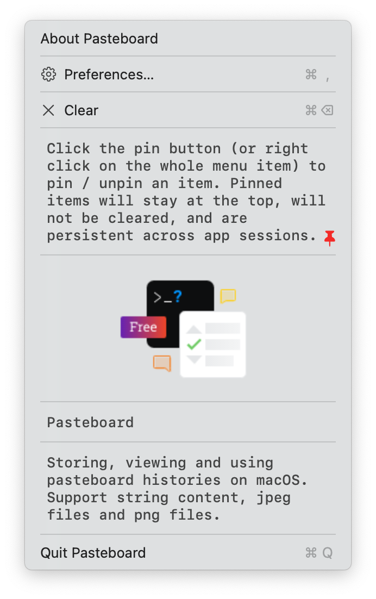

# Pasteboard

Storing, viewing and using pasteboard histories on macOS. Support recording string content, 
jpeg files and png files.

## Usage

The app will record every change in system's pasteboard since the launch of the app. 
In addition, if you turn `Save History` on in Preferences, records from previous
sessions will be restored.

### Using the Stored Content

To make use of the contents, you can:

- **Click on the pasteboard item on the menu.** This will copy the content into your pasteboard.
- **Drag and drop the item on the menu.**

### Shortcuts

Press `⌥⌘+P` to open the menu.
